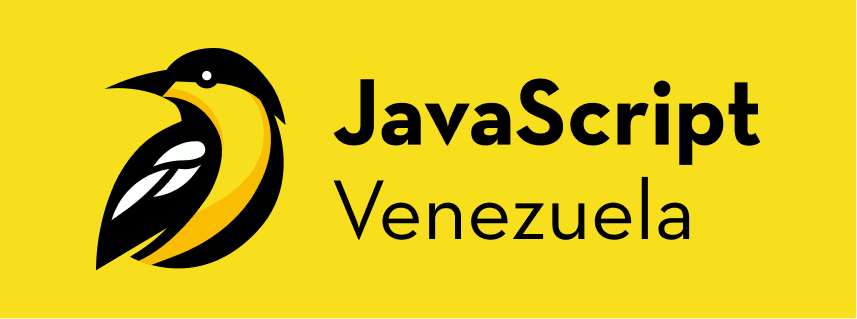

<a name="readme-top"></a>

<div align="center">

[](https://discord.com/invite/WPHTNgFPkx)
[](https://x.com/javascript_vzla)
[](https://instagram.com/javascript_vzla/)
[](https://linkedin.com/company/js-venezuela/)
[](https://twitch.tv/javascript_vzla)

<a href="https://github.com/JS-Venezuela/js-venezuela-web">
  
</a>

## Web oficial JavaScript Venezuela

Somos una comunidad inclusiva, compuesta por personas con una amplia gama de intereses en tecnología. Desde el desarrollo de software hasta el diseño, pasando por la creación de contenido y más allá, todos son bienvenidos. Valoramos la diversidad de conocimientos y la riqueza que esta aporta a nuestro grupo.\
[Reportar error](https://github.com/JS-Venezuela/js-venezuela-web/issues) · [Sugerir algo](https://github.com/JS-Venezuela/js-venezuela-web/issues)

</div>

## Para empezar

### Prerequisitos

- PNPM (lo recomendamos por su eficiencia y rapidez)

  ```sh
  npm install -g pnpm
  ```

- o NPM

  ```sh
  npm install npm@latest -g
  ```

### Instalación

1. Clona el repositorio

   ```sh
   git clone https://github.com/JS-Venezuela/js-venezuela-web
   ```

2. Instala los paquetes de NPM

   ```sh
   pnpm install
   ```

3. Ejecuta el proyecto

   ```sh
   pnpm run dev
   ```

<p align="right">(<a href="#readme-top">volver arriba</a>)</p>

## Contribuir al proyecto

Las contribuciones son lo que hacen que la comunidad de código abierto sea un lugar increíble para aprender, inspirar y crear. ¡Cualquier contribución que hagas es **muy apreciada**!

Si tienes alguna sugerencia que podría mejorar el proyecto, por favor, haz un [_fork_](https://github.com/JS-Venezuela/js-venezuela-web/fork) del repositorio y crea una [_pull request_](https://github.com/JS-Venezuela/js-venezuela-web/pulls). También puedes simplemente abrir un [_issue_](https://github.com/JS-Venezuela/js-venezuela-web/issues) con la etiqueta "enhancement".

Aquí tienes una guía rápida:

1. Haz un [_fork_](https://github.com/JS-Venezuela/js-venezuela-web/fork) del Proyecto
2. Clona tu [_fork_](https://github.com/JS-Venezuela/js-venezuela-web/fork) (`git clone <URL del fork>`)
3. Entra al directorio de tu [_fork_](https://github.com/JS-Venezuela/js-venezuela-web/fork) (`cd <NOMBRE del fork>`)
4. Añade el repositorio original como remoto (`git remote add upstream <URL del repositorio original>`)
5. Crea tu Rama de Funcionalidad (`git checkout -b feature/CaracteristicaIncreible`)
6. Realiza tus Cambios (`git commit -m 'Add: alguna CaracterísticaIncreible'`)
7. Haz Push a la Rama (`git push origin feature/CaracteristicaIncreible`)
8. Abre una [_pull request_](https://github.com/JS-Venezuela/js-venezuela-web/pulls)


<p align="right">(<a href="#readme-top">volver arriba</a>)</p>

## 🛠️ Stack

- [Astro](https://astro.build/) - El framework para sitios web basados ​​en contenido.
- [Tailwind](https://tailwindcss.com/) - Un framework CSS de utilidad para crear rápidamente diseños personalizados.

<p align="right">(<a href="#readme-top">volver arriba</a>)</p>